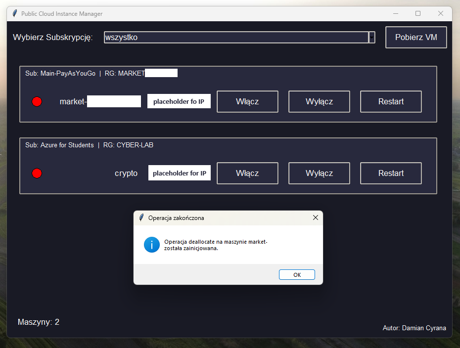

# Public Cloud Instance Manager

This project is a graphical user interface (GUI) application designed to manage Azure Virtual Machines (VMs) using the Azure SDK for Python. The application allows users to start, stop, and restart VMs across multiple subscriptions with ease.

## Features

- **Subscription Management**: Select and list VMs across multiple Azure subscriptions.
- **VM Control**: Start, stop, and restart VMs.
- **Status Monitoring**: Display the current status of each VM.
- **Copy IP Address**: Easily copy the public IP address of each VM.

## Usage

1. Launch the application.
2. Select a subscription from the dropdown menu and click "Pobierz VM" to list the VMs.
3. Use the buttons to start, stop, or restart the VMs.
4. Click on the IP address to copy it to your clipboard.

## Author

- Damian Cyrana
